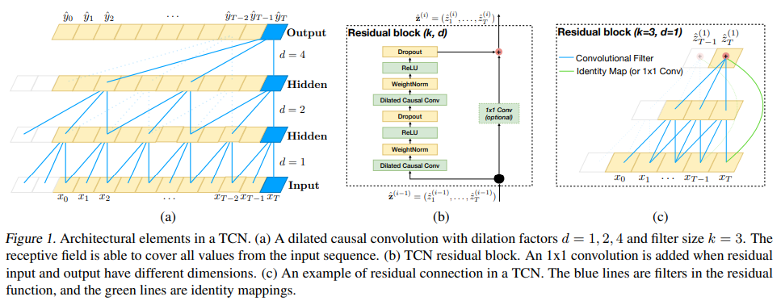

# 时间卷积模型TCN

## 1、什么是TCN

TCN全称Temporal Convolutional Network，时序卷积网络，是在2018年提出的一个卷积模型，但是可以用来处理时间序列。

TCN模型以CNN模型为基础，并做了如下改进：
* 1、适用序列模型：因果卷积（Causal Convolution）
* 2、记忆历史：空洞卷积/膨胀卷积（Dilated Convolution），残差模块（Residual block）

### 1.1 因果卷积（Causal Convolution）

序列问题转化为根据 $X=(x_1,x_2,...,x_t)$ 预测 $Y=(y_1,y_2,...,y_t)$ ，在因果卷积中，有滤波器 $F=(f_1,f_2,...,f_K)$ ，序列$X$在 $x_t$ 处的因果卷积为：$$({F}\times{X})_{x_{t}}=\sum_{k=1}^{K}f_{k}x_{t}+k$$。假设Input最后两个节点本别为$x_{t-1},x_t$，第一层Hidden Layer的最后一个节点为$y_t$，滤波器$F=(f_1,f_2)$，根据公式有$y_t=f_{1}x_{t-1}+f_{2}x_{t}$。

因果卷积有两个特点：

* 1、不考虑未来的信息。
* 2、追溯历史信息越久远，隐藏层越多。

### 1.2 空洞卷积（Dilated Convolution）

标准的 CNN 通过增加 pooling 层来获得更大的感受野，而经过 pooling 层后存在信息损失的问题。空洞卷积是在标准的卷积中注入空洞，增加感受野，既增加超参数 dilation rate（Kernel的间隔数量，标准的CNN中 dilation rate 为1）。定义空洞卷积滤波器$F=(f_1,f_2,...,f_K)$， 序列$X=(x_1,x_2,...,x_T)$，在$x_t$处的 dilation rate 等于 d 的空洞卷积为：$(F\times{X})_{(x_t)}=\sum_{k=1}^{K}f_{k}x_{t-(K-k)d}$。假设Input最后五个节点分别为$x{t-4},x_{t-3},x_{t-2},x_{t-1},x_t$，第二层隐含层的左后一个几点为$y_t$，滤波器$F=(f_1,f_2,f_3)$，则有$y_t=f_{1}x_{t-2d}+f_{2}x_{t-d}+f_{3}x_t,(d=2)$。

### 1.3 残差网络

**load...**

## 2 、TCN（Temporal Convolutional Network）时间卷积网络

